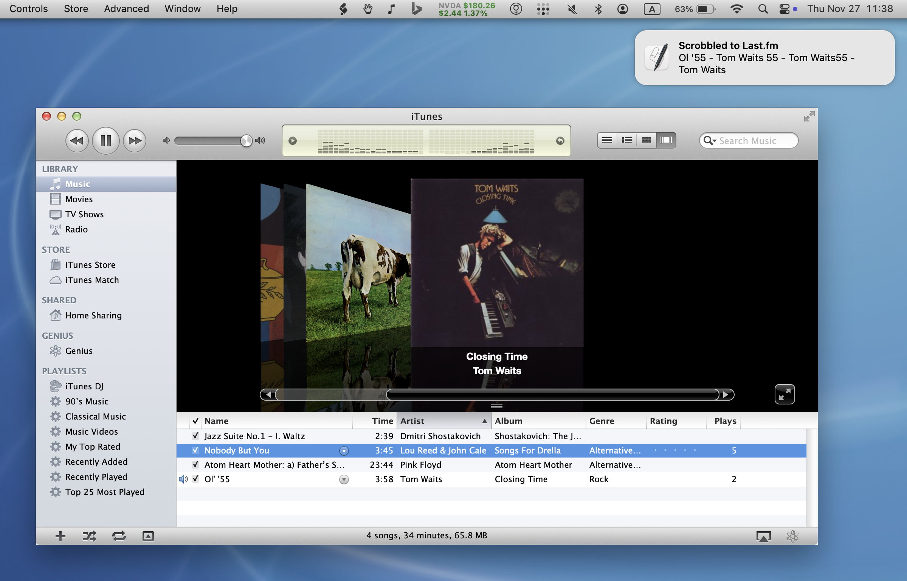

# Retroactive iTunes Scrobbler

A lightweight Ruby daemon that watches iTunes 10 (via [Retroactive](https://github.com/cormiertyshawn895/Retroactive)) and scrobbles plays to Last.fm.



## Features
- Automatic Last.fm scrobbling when a track is >50% played
- Mac OS notifications when a track is scrobbled
- Background daemon suitable for a LaunchAgent
- Uses built-in `osascript` to read iTunes state; no extra gems needed

## Requirements
- Mac OS 10.15+ with iTunes 10 installed via [Retroactive](https://github.com/cormiertyshawn895/Retroactive). You can still use iTunes 10 on Mac OS 15.7.2 with Apple Silicon; you just need one extra step to code sign iTunes: `sudo codesign --force --deep --sign - /Applications/iTunes.app` (thanks to [this Reddit post](https://old.reddit.com/r/ipod/comments/1m9uk1f/psa_you_still_can_use_itunes_107_in_macos_sequoia/)).
- Ruby 3.4+ (install with Homebrew: `brew install ruby`)
- Bundler (`gem install bundler`)
- Last.fm API key/secret and session key (see below)

## Installation

1) Install Ruby and Bundler
```bash
brew install ruby
/opt/homebrew/opt/ruby/bin/ruby -v
/opt/homebrew/opt/ruby/bin/gem install bundler
```

2) Clone the repo
```bash
git clone https://github.com/felixding/retroactive-itunes-scrobbler.git
cd retroactive-itunes-scrobbler
bundle install
```

3) Configure Last.fm credentials
```bash
cp config.yml.example config.yml
# edit config.yml: set lastfm.api_key and lastfm.api_secret
```

4) Generate a Last.fm session key
```bash
ruby get_lastfm_session_token.rb
```
Follow the prompt to authorize in your browser. Copy the returned `session_key` (`sk`) into `config.yml` under `lastfm.session_key`.

5) Run the daemon manually
```bash
bundle exec ruby app.rb
```
Keep it running to scrobble. Logs: `~/Library/Logs/retroactive-itunes-scrobbler/daemon.log` and, if run via LaunchAgent, `stdout.log` / `stderr.log` in the same directory.

6) Optional: LaunchAgent auto-start
```bash
cp com.retroactive.itunes.scrobbler.plist ~/Library/LaunchAgents/
# Edit the plist paths if your install directory differs.
launchctl load ~/Library/LaunchAgents/com.retroactive.itunes.scrobbler.plist
```

## Usage
- Start iTunes 10 and play music.
- The daemon polls iTunes every 10 seconds and scrobbles when eligibility rules are met.
- Notifications: Mac OS may block osascript until you allow it. Open Script Editor and run:
  ```applescript
  display notification "Hi all"
  ```
  When prompted, allow notifications for Script Editor.

## Troubleshooting
- **No scrobbles**: verify `config.yml` keys, check `~/Library/Logs/retroactive-itunes-scrobbler/daemon.log` (and `stdout.log` / `stderr.log` if using LaunchAgent), ensure the track played long enough.
- **Notifications missing**: enable notifications for your terminal app; the daemon logs a warning if `osascript` fails.
- **iTunes errors**: confirm iTunes 10 is running and AppleScript is enabled; try `osascript -e 'tell application "iTunes" to player state'` in Terminal.

## File map
- `app.rb` — main daemon
- `config.yml` — Last.fm keys and session key
- `get_lastfm_session_token.rb` — helper to fetch a session key
- `com.retroactive.itunes.scrobbler.plist` — LaunchAgent template

## License
Licensed under the GNU General Public License v3.0 (GPL-3.0).
